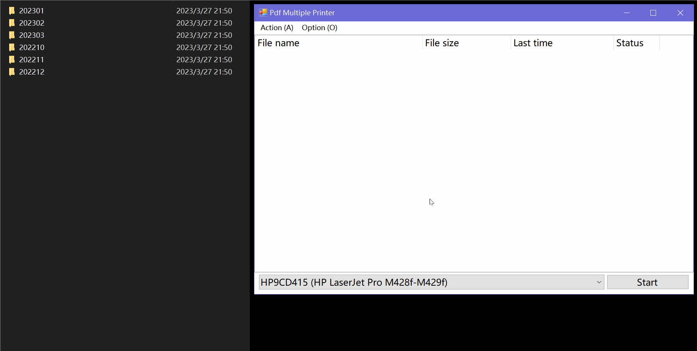

# Introduce 介绍

This is an extremely simple software that can print multiple PDFs at once, suitable for bulk printing of resumes, invoices and other documents. 一个非常简单的软件，可以一次性打印多个PDF文件，适用于批量打印简历、发票等场景。

1. You can drag the directory containing PDF files or the PDF files themselves into the window, and the program will automatically traverse and add all PDF files in the directory. 将包含PDF文件的目录或PDF文件本身拖入窗口，程序会自动遍历并添加目录中所有的PDF文件。

3. Select the printer name you need from the printer drop-down list. 从打印机下拉列表中选择所需的打印机名称。

5. Click on the button to begin printing. 点击按钮开始打印。

# Platform 支持的平台及系统

.Net Framework 4.6.1

- Windows 11
- Windows 10
- Windows 7 SP1
- Windows 8.1
- Windows Server 2012 R2
- Windows Server 2012
- Windows Server 2008 R2 SP1

# Language 支持的语言

- Chinese
- English

> Additional language support can be provided by modifying `MultiplePdfPrinter/Language.cs`. 可以通过修改 `MultiplePdfPrinter/Language.cs` 来提供额外的语言支持。
